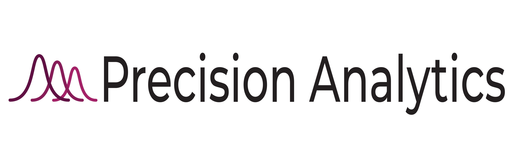
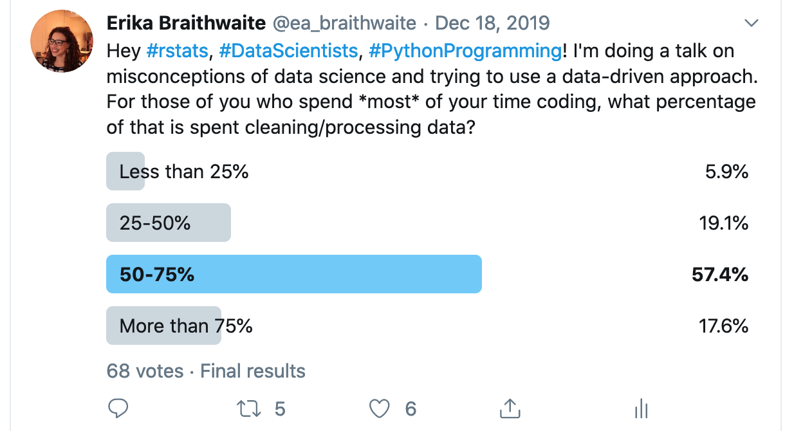
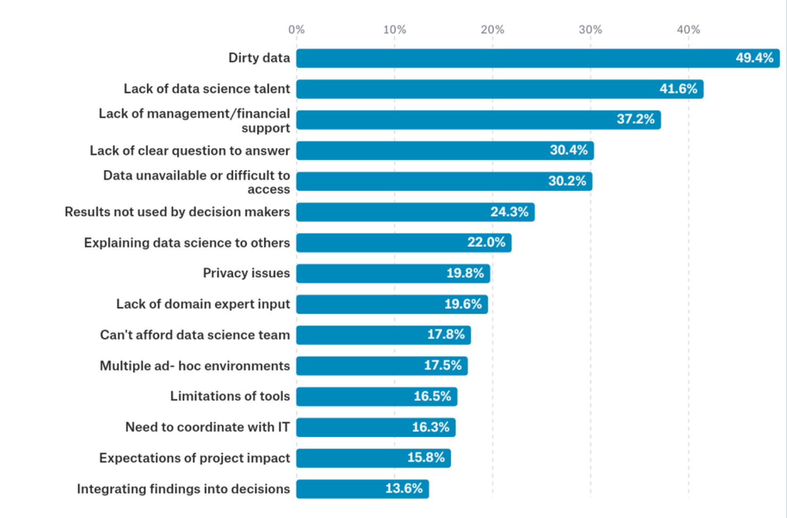
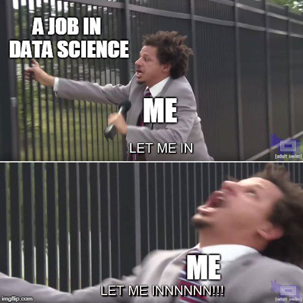
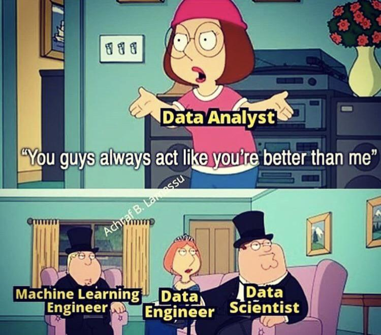

```{r setup, include=FALSE}

knitr::opts_chunk$set(echo = FALSE, message = FALSE, warning = FALSE)
library(dplyr)
library(ggplot2) 
library(magrittr)
library(forcats)
library(tidyr)
library(kableExtra)
library(emo)
library(ggforce)
library(limma)
library(scales)
library(ggthemes)
library(viridis)
library(viridisLite)


# Read in data 
schema = read.csv("data/survey_schema.csv")
questions = read.csv("data/questions_only.csv")
multiple = read.csv("data/multiple_choice_responses.csv")

# select smaller subset of data and rename variables
df = multiple %>% select(Q1, Q2, Q3, Q4, Q5, Q8, starts_with("Q9"), starts_with("Q13"),
                         Q14, Q15, starts_with("Q18"), Q19, starts_with("Q20"), 
                         Q23, starts_with("Q24"), starts_with("Q27"), starts_with("Q31")) %>% 
                  rename(age = Q1, 
                         gender = Q2, 
                         country = Q3, 
                         edu = Q4, 
                         position = Q5, 
                         Analysis = Q9_Part_1, 
                         Infrastructure = Q9_Part_2, 
                         `Built ML prototype` = Q9_Part_3, 
                         `Build ML models` = Q9_Part_4, 
                         `Improve ML models` = Q9_Part_5, 
                         `Research ML models` = Q9_Part_6, 
                         `N/A ML` = Q9_Part_7, 
                         Udacity = Q13_Part_1, 
                         Coursera = Q13_Part_2, 
                         Edx = Q13_Part_3, 
                         Datacamp = Q13_Part_4, 
                         Dataquest = Q13_Part_5, 
                         Kaggle = Q13_Part_6, 
                         FastAI = Q13_Part_7, 
                         Udemy = Q13_Part_8, 
                         LinkedIn = Q13_Part_9, 
                         University = Q13_Part_10, 
                         `No course` = Q13_Part_11,  
                         `Other course`= Q13_Part_12,
                         primary_tool = Q14, 
                         code_yrs = Q15, 
                         Python = Q18_Part_1, 
                         R = Q18_Part_2, 
                         SQL = Q18_Part_3, 
                         C = Q18_Part_4, 
                         `C++` = Q18_Part_5, 
                         Java = Q18_Part_6, 
                         JavaScript = Q18_Part_7, 
                         TypeScript = Q18_Part_8, 
                         Bash = Q18_Part_9, 
                         Matlab = Q18_Part_10, 
                         yrs_ML = Q23, 
                         lin_logistic = Q24_Part_1,
                         trees = Q24_Part_2, 
                         boosted = Q24_Part_3, 
                         bayes = Q24_Part_4, 
                         evo_nets = Q24_Part_5, 
                         dense_nets = Q24_Part_6, 
                         convo_nets = Q24_Part_7, 
                         gen_nets = Q24_Part_8, 
                         rec_nets = Q24_Part_9, 
                         trans_nets= Q24_Part_10, 
                         None = Q24_Part_11, 
                         nlp_word_embed = Q27_Part_1, 
                         nlp_encode_decode = Q27_Part_2, 
                         nlp_context_embed = Q27_Part_3, 
                         nlp_transform = Q27_Part_4, 
                         nlp_None = Q27_Part_5) 

# Remove first row of variable full names 
df = df[-1,]

# For academic background 
multiple_2018 = read.csv("data/multiple_choice_responses2018.csv") %>% 
  select(Q5)


```


Welcome!
===================================================

So you're thinking about leaving the comforting womb of university, and transitioning to a data science career? You may be feeling....

> - Overwhelmed by the possibilies
> - Confused about the terminology
> - Insecure about your capacities
> - And so many more emotions 

Why {#why}
====================================================


Objectives {#objective}
===================================================

I'll do my best to address these objectives in the most data-driven approach I can!

> - Dispel some myths about the data science industry 
> - Tips on how to transition
> - Let's talk about your CV, the job search and the interview
> - Bestow some glimmer of hope `r emo::ji("star")`


A bit about me
===================================================

I'm the CEO of a health data science startup in Montreal
www.precision-analytics.ca

```{r me, out.width= "20%", out.extra='style="float:right; padding:10px"'}
knitr::include_graphics("figs/me.jpg")
```

**My background**

- BA Psychology, Concordia
- MSc Psychology, Université de Montréal 
- PhD Epidemiology and Biostatistics, McGill 

**Our company**

- Founded in 2017
- Began as a statistical consultancy, evolved to a blend of Software as a Service
- Work in the biopharmaceutical sector to create tools that combine data storage, analysis and communication

```{r pa_log, out.width = "30%", fig.align='center'}

```


Our story {#story}
===================================================


What is a data scientist
===================================================

A combination of programmoing, statistics and domain knowledge. 

I like to think of it as *story telling using data*

```{r ds_fig, out.width = "50%", fig.align='center'}

venn_ds = data.frame(x = c(0, 2, -2),
                     y = c(2.5, -0.5, -0.5),
                     labels = c('Math & Stats', 'Domain \nKnowledge', 'Programming')) 

ggplot(data = venn_ds, aes(x0 = x, y0 = y, r = 2.5, fill = labels)) +
  geom_circle(alpha = .3, size = 1, colour = 'grey') +
  coord_fixed() +
  theme_void() + 
  theme(legend.position = 'bottom') +
  labs(fill = NULL) +
  theme(legend.position = "none") + 
  scale_fill_viridis(option = "D", discrete = TRUE) +
  annotate("text", x = venn_ds$x, y = venn_ds$y, label = venn_ds$labels, size = 8)


```


A very scary (and real) job posting {.smaller}
===================================================


> - Coding knowledge and experience with several languages: C, C++, Java, JavaScript, etc.
> - Knowledge and experience in statistical and data mining techniques: GLM/Regression, Random Forest, Boosting, Trees, text mining, social network analysis, etc.
> - Experience querying databases and using statistical computer languages: R, Python, SLQ, etc.
> - Experience using web services: Redshift, S3, Spark, Digital Ocean, etc.
> - Experience creating and using advanced machine learning algorithms and statistics: regression,
simulation, scenario analysis, modeling, clustering, decision trees, neural networks, etc.
> - Experience analyzing data from 3rd party providers: Google Analytics, Site Catalyst, Coremetrics, Adwords, Crimson Hexagon, Facebook Insights, etc.
> - Experience with distributed data/computing tools: Map/Reduce, Hadoop, Hive, Spark, Gurobi, MySQL, etc.
> - Experience visualizing/presenting data for stakeholders using: Periscope, Business Objects, D3, ggplot, etc.


Myths about data science {#myths}
====================================================


> - Myth 1. You need a PhD to become a data scientist 


> - Myth 2. Python is the only tool used in data science


> - Myth 3. Data science == AI & machine learning


> - Myth 4. Data science is all about technical skills 


Letting the data speak! {.smaller}
===================================================
To tackle these myths, Kaggle conducts annual survey of data scientists. Almost 20,000 respondents completed the survey from over 60 countries in 2018 and 2019.
```{r respondent-plot, out.width= "65%"}

cols <- viridis(3)
cols <- substr(cols, 0, 7)

highcharter::highchart(type = "map") %>%
  highcharter::hc_add_series_map(highcharter::worldgeojson,
                    df %>% 
                      group_by(country) %>% 
                      summarise(n = n()) %>%
                      mutate(freq = round(n / sum(n),2)) %>% 
                      ungroup() %>%
                      mutate(iso2 = countrycode::countrycode(country, origin="country.name", destination="iso2c")),
                    value = "freq", joinBy = "iso2") %>%
  highcharter::hc_title(text = "Respondents by country") %>%
  highcharter::hc_colors(cols)
  


```
`r emo::ji("bangbang")` Kaggle is a platform that hosts machine learning competitions. It's users are not representative of the entire data science community `r emo::ji("bangbang")`

Data available for [2018](https://www.kaggle.com/kaggle/kaggle-survey-2018) and   [2019](https://www.kaggle.com/c/kaggle-survey-2019)

Demographics of respondents 
=====================================================

```{r demo-plot}
df %>% 
  select(gender, age) %>% 
  droplevels() %>% 
  ggplot(aes(x = age, fill = gender)) + 
  geom_bar(position = "fill") + 
  labs(x = "age categories", 
       y = "Percentage", 
       title = "Gender groups by age categories") +
  scale_y_continuous(expand = c(0,0), limits = c(0, 1)) +
  theme_minimal() +
  scale_fill_viridis(option = "D", discrete = TRUE)
```

Types of data scientist positions
===================================================

```{r position-plot}
position_factor = 
  forcats::fct_collapse(df$position, 
                        "Business Analyst"= "Business Analyst", 
                        "Data Analyst" = "Data Analyst",
                        "Data Engineer" = "Data Engineer", 
                        "Database Engineer" = "DBA/Database Engineer", 
                        "Not employed" = "Not employed", 
                        "Other" = "Other", 
                        "Project Manager" = "Product/Project Manager",
                        "Research Scientist" = "Research Scientist",
                        "Software Engineer" = "Software Engineer",
                        "Student" = "Student",
                        Missing = c("", "Select the title most similar to your current role (or most recent title if retired): - Selected Choice") 
  )


data.frame(fct_count(position_factor)) %>% 
  mutate(prop = round(n/sum(n),2)) %>% 
  ggplot(aes(x = reorder(f, -prop), y = prop, fill = f)) + geom_bar(stat = "identity") + 
  theme_minimal() + 
  scale_y_continuous(expand = c(0,0), limits = c(0, 1)) + 
  ggtitle("Type of position") + 
  labs(x = "Position", 
       y = "Percentage") + 
  theme(legend.position = "none") + 
  scale_fill_viridis(option = "D", discrete = TRUE) +
  geom_text(aes(x = f, 
                y = prop + 0.05, label = round(prop, 2))) + coord_flip()

```

Academic background 
===================================================


```{r major}
major_factor = 
  forcats::fct_collapse(multiple_2018$Q5, 
                        "Business"= "A business discipline (accounting, economics, finance, etc.)", 
                        "Comp. Science" = "Computer science (software engineering, etc.)",
                        Engineering = "Engineering (non-computer focused)", 
                        "Environment/Geo" = "Environmental science or geology", 
                        "Fine arts" = "Fine arts or performing arts", 
                        "No major" = "I never declared a major",
                        "IT" = "Information technology, networking, or system administration",
                        "Math/Stats" = "Mathematics or statistics",
                        "Life Science" = "Medical or life sciences (biology, chemistry, medicine, etc.)",
                        "Other" = "Other",
                        "Physics/astronomy" = "Physics or astronomy",
                        "Humanities" = "Humanities (history, literature, philosophy, etc.)",
                        "Social Science" = "Social sciences (anthropology, psychology, sociology, etc.)",
                        Missing = c("Which best describes your undergraduate major? - Selected Choice"), 
                        NULL = "")

data.frame(fct_count(major_factor)) %>% 
  droplevels() %>% 
  mutate(prop = round(n/sum(n),2)) %>% 
  ggplot(aes(x = reorder(f, -prop), y = prop, fill = f)) + geom_bar(stat = "identity") + 
  theme_minimal() + 
  scale_y_continuous(expand = c(0,0), limits = c(0, 1)) + 
  ggtitle("Major in University") + 
  labs(x = "Position", 
       y = "Percentage") + 
  theme(legend.position = "none") + 
  geom_text(aes(x = f, 
                y = prop + 0.05, label = round(prop, 2))) + coord_flip() + 
  scale_fill_viridis(option = "D", discrete = TRUE)
```


Myth 1. You need a PhD to become a data scientist
====================================================

```{r phd_plot}
new_factor = 
  forcats::fct_collapse(df$edu, 
              "Bachelor's"= "Bachelor’s degree", 
              "Master's" = "Master’s degree",
              PhD = "Doctoral degree", 
              Highschool = "No formal education past high school", 
              "Prof. degree" = "Professional degree", 
              "Some college/uni" = "Some college/university study without earning a bachelor’s degree",
              Missing = c("", "I prefer not to answer", "What is the highest level of formal education that you have attained or plan to attain within the next 2 years?"))

phdtxt = "Only 14% of self-identified data scientists hold a PhD!"

data.frame(fct_count(new_factor)) %>% 
  mutate(prop = round(n/sum(n),2), 
         adv = ifelse(f == "PhD", TRUE, FALSE)) %>% 
  ggplot(aes(x = reorder(f, -prop), y = prop, fill = adv)) + geom_bar(stat = "identity") + 
  theme_bw() + 
  geom_label(data = data.frame(x = 1.5, y = .5, label = phdtxt), 
             aes(x = x, y = y, label = phdtxt), 
             hjust = 0, 
             lineheight = 8, 
             inherit.aes = FALSE,  
             label.size = NA) +
  geom_curve(data = data.frame(x = 3, y = .45, xend = 3, yend = .25), 
             mapping = aes(x = x, y = y, xend = xend, yend = yend), 
             colour = "#2D708EFF", 
             size = 1.5, 
             curvature = -0.1, 
             arrow = arrow(length = unit(0.01, "npc"), type = "closed"),
             inherit.aes = FALSE) +
  scale_y_continuous(expand = c(0,0), limits = c(0, 1)) + 
  ggtitle("Highest level of education") + 
  theme_minimal() +
  labs(x = "Highest level of education", 
       y = "Percentage") +
  theme(legend.position = "none") + 
  scale_fill_viridis(option = "D", discrete = TRUE) +
  geom_text(aes(x = f, 
                y = prop + 0.05, label = round(prop, 2)))
```


Experience of respondents 
====================================================

```{r coding_plot}
coding_factor = 
  forcats::fct_collapse(df$code_yrs, 
                        "< 1 year"= "< 1 years", 
                        "1-2 years" = "1-2 years",
                        "3-5 years" = "3-5 years", 
                        "5-10 years" = "5-10 years", 
                        "10-20 years" = "10-20 years", 
                        "20+ years" = "20+ years",
                        Missing = c("", "How long have you been writing code to analyze data (at work or at school)?") 
  )


coding_text = "Most people have been coding for only 1-2 years!"

data.frame(fct_count(coding_factor)) %>% 
  mutate(prop = round(n/sum(n),2), 
         adv = ifelse(f == "1-2 years", TRUE, FALSE), 
         f = factor(f, levels = c("< 1 year", "1-2 years", "3-5 years", "5-10 years", "10-20 years", "20+ years"))) %>%
  filter(f != "Missing" & f != "I have never written code") %>% 
  ggplot(aes(x = f, y = prop, fill = adv)) + geom_bar(stat = "identity") + 
  scale_y_continuous(expand = c(0,0), limits = c(0, 1)) + 
  ggtitle("Number of years coding") + 
  labs(x = "Number of years", 
       y = "Percentage") +
  theme_minimal() + 
  theme(legend.position = "none") + 
  geom_text(aes(x = f, 
                y = prop + 0.05, label = round(prop, 2))) +
  geom_curve(data = data.frame(x = 3, y = .60, xend = 2, yend = .35), 
             mapping = aes(x = x, y = y, xend = xend, yend = yend), 
             colour = "#2D708EFF",
             size = 1.5, 
             curvature = 0.1, 
             arrow = arrow(length = unit(0.01, "npc"), type = "closed"),
             inherit.aes = FALSE) + 
  geom_label(data = data.frame(x = 2, y = .65, label = coding_text), 
             aes(x = x, y = y, label = coding_text), 
             hjust = 0, 
             lineheight = 8, 
             inherit.aes = FALSE,  
             label.size = NA) + 
  scale_fill_viridis(option = "D", discrete = TRUE) 
```


Myth 2. Python is the only tool used in data science
===================================================


```{r python_plot}
box = "Basic statistical software: Excel, Google sheets \n
Development environments: RStudio, JupyterLab \n
Statistical software: Python, R, SPSS, SAS \n
Business intelligence: Salesforce, Tableau, Spotfire \n
Cloud based: AWS, Azure \n" 

df %>% filter(code_yrs == "I have never written code") %>% 
  mutate(tool = fct_recode(primary_tool, 
                           "Statistical software" = "Advanced statistical software (SPSS, SAS, etc.)",
                           "Basic software" = "Basic statistical software (Microsoft Excel, Google Sheets, etc.)",
                           "BI software" = "Business intelligence software (Salesforce, Tableau, Spotfire, etc.)", 
                           Cloud = "Cloud-based data software & APIs (AWS, GCP, Azure, etc.)",
                           "Dev. environment" = "Local development environments (RStudio, JupyterLab, etc.)", 
                           Other = "Other",
                           Missing = "", 
                           Missing = "What is the primary tool that you use at work or school to analyze data? (Include text response) - Selected Choice")) %>% 
  count(tool) %>% 
  mutate(prop = round(n/sum(n),2))  %>% 
  ggplot(aes(x = reorder(tool, -prop), y = prop, fill = tool)) + geom_bar(stat = "identity") + 
  theme_minimal() + 
  geom_label(data = data.frame(x = 4.5, y = .30, label = box), 
             aes(x = x, y = y, label = label), 
             hjust  = 0, 
             lineheight = .7, 
             inherit.aes = FALSE, 
             label.size = 0) + 
  geom_text(aes(label = round(prop,2)), hjust = -0.5, position = position_dodge(0.9)) + 
  scale_y_continuous(expand = c(0,0), limits = c(0, 1)) + 
  ggtitle("Primary tool used at work or school", 
          subtitle = "Multiple choice categories") + 
  labs(x = "Tool", 
       y = "Percentage") +
  theme(legend.position = "none") +
  coord_flip() + 
  scale_fill_viridis(option = "D", discrete = TRUE) 


```

Myth 3. Data science == Machine learning and AI {.flexbox .vcenter}
==================================================


```{r ml_plot}
df %>% filter(!position %in% c("Student", "Not employed")) %>% 
  mutate(ml_atwork = fct_recode(Q8, 
                                "No" = "No (we do not use ML methods)",
                                "Not yet, \nbut eventually" = "We are exploring ML methods (and may one day put a model into production)",
                                "Yes <2 years" = "We recently started using ML methods (i.e., models in production for less than 2 years)",
                                "Yes >2 years" = "We have well established ML methods (i.e., models in production for more than 2 years)",
                                "Yes, but \nnot in production"= "We use ML methods for generating insights (but do not put working models into production)",
                                "Missing" = "", 
                                NULL = "Does your current employer incorporate machine learning methods into their business?)", 
                                "Do not know" = "I do not know")) %>% 
  count(ml_atwork) %>% 
  mutate(prop = round(n/sum(n),2), 
         ml = ifelse(ml_atwork %in% c("Yes <2 years", "Yes >2 years", 
                                      "Yes, but \nnot in production"), "Yes", "No")) %>% 
  ggplot(aes(x = ml_atwork, y = prop, fill = ml)) + geom_bar(stat = "identity") + 
  theme_minimal() + 
  geom_text(aes(label = round(prop,2)), vjust = -0.5, position = position_dodge(0.9)) + 
  scale_y_continuous(expand = c(0,0), limits = c(0, 1)) + 
  ggtitle("Is machine learning used in your organization?") + 
  labs(x = "", 
       y = "Percentage", 
       caption = "Data source: https://www.kaggle.com/c/kaggle-survey-2019/overview") + 
  theme(legend.position = "none") + 
  annotate("text", x = 2, y = .75, label = "47% of respondents report 
           using machine learning in their organizations") + 
  geom_curve(data = data.frame(x = 4, y = .75, xend = 6, yend = .30), 
             mapping = aes(x = x, y = y, xend = xend, yend = yend), 
             colour = "#2D708EFF",
             size = 1.5, 
             curvature = -0.1, 
             arrow = arrow(length = unit(0.01, "npc"), type = "closed"),
             inherit.aes = FALSE) + 
  scale_fill_viridis(option = "D", discrete = TRUE) 
  

```


Myth 4. Data science challenges are mostly analytical 
==================================================

The survey did not explicitly ask the way respondents broke up their time. So I did the next best thing... ask twitter

```{r tweet_fig, out.width = "50%", fig.align='center'}

```

Data scientists challenges {.smaller}
=================================================

In 2017, the Kaggle survey asked respondents about the "biggest challenges in data science".

From here we can  see that most people identify "dirty data" the toughest part of the job. The rest of the issues seem be organizational. 

```{r challenges, out.width="60%"}

```

On transitioning {#transition}
=================================================

<div style="font-weight:bold;font-size:70px;color:black;position: fixed; top:40%; text-align:center;left:25%;padding:1em;">On transitioning</div>


I want a ds job {#job}
==================================================

```{r job-fig, out.width = "50%", fig.align='center'}

```


Understand your new "audience"
==================================================

`r emo::ji("moneybag")` The currency in academia versus the currency in the private sector `r emo::ji("moneybag")`


```{r venn-diagram}
DS = c(0, 0, 1)
Academia = c(0, 1, 1)
x = c(2.7, -2.7, 0)
y = c(-0.6, -0.6, -0.6)
skill = c("GPA, Poster presentation\n Published papers\n Teaching \n Teaching/research assistant", 
          "Portfolio\n Work experience \nTechnical skills \nTeam management \nBusiness accumen", 
          "")

intersection = "Critical thinking \ncommunication \ndomain knowledge \nproblem solving \nintellectual curiosity"

df = data.frame(DS, Academia, x, y, skill)

# define circle parameters
df.venn2 = data.frame(x = c(-2.7, 2.7), 
                      y = c(-0.5, -0.5), 
                      labels = c("Data Science", "Academia"))

ggplot(df.venn2) +
  geom_circle(aes(x0 = x, y0 = y, r = 4, fill = labels), alpha = .2, size = 1, colour = 'grey') +
  coord_fixed() +
  theme_void() +
  scale_y_continuous(limits = c(-6, 6)) +
  labs(fill = NULL) +
  annotate("text", x = df$x, y = df$y, label = df$skill, size = 4.5) +
  annotate("text", x = 0, y = 4.5, label = "Critical thinking communication, domain knowledge, 
           \nproblem solving and intellectual curiosity", size = 5) + 
  geom_curve(data = data.frame(x = 0, y = 3.5, xend = 0, yend = -0.5), 
             mapping = aes(x = x, y = y, xend = xend, yend = yend), 
             colour = "#2D708EFF", 
             size = 1.5, 
             curvature = 0, 
             arrow = arrow(length = unit(0.01, "npc"), type = "closed"),
             inherit.aes = FALSE) +
  scale_fill_viridis(option = "D", discrete = TRUE)

```


Gaining  more  experience: Courses 
=================================================

The American Statistical Association held a two-day Data Science summit. 72 educators, researchers and practitioners in statistics, mathematics, computer science, and data science from academia, industry, government and nonprofit gathered to put forth recommendations for future data science programs. 

Data science courses should expose students to: 

```{r what-to-learn}
rbind("Introduction to statistics", "
           Data analysis in the real world", 
           "Math and algorithms", 
           "Answering real problems", 
           "Expose students to modern tools", 
           "Teach data ethics", 
           "Active learning") %>% 
  kable() %>% 
  kable_styling(bootstrap_options = c("hover", "condensed", "striped"), font_size = 20)
```

I'd add to this list: study design. Knowing how data was generated/collected will always inform the types of questions you can ask, and appropriate method of analysis. 


How to pick a learning strategy 
==================================================


```{r types-learning}
data.frame(Type = c("MOOC", "MOOC", 
                    "Bootcamp", "Bootcamp", 
                    "Certificate", "Certificate",
                    "MSc", "MSc"), 
           Pros = c("Low cost and commitment", 
                   "Good for beginners",
                   "Short and intense", 
                   "Connect to employers",
                   "Supplement existing degree", 
                   "Shorter and less expensive than a degree", 
                   "Gain research experience & skills",
                    "Leverage University name and degree recognition"), 
           Cons = c("Self-guided learning may be less efficient than other methods",
                    "Lack credibility",
                    "Can be expensive",
                    "Not guaranteed to be recognized by employer", 
                    "Very general",
                    "", 
                    "Siloed depts", 
                    "Slow to update curriculums")) %>%
  kable() %>% 
  kable_styling(bootstrap_options = "striped", font_size = 24) %>% 
  collapse_rows(columns = 1:2, valign = "top") %>% 
  footnote(general = "Source: Data Science Careers, Training, and Hiring: A Comprehensive Guide to the 
  Data Ecosystem:How to Build a Successful Data Science Career, Program, or Unit. (2019) Rawlings-Goss, R. In Springer Briefs in Computer Science. https://doi.org/10.1007/978-3-030-22407-3")
```

Gaining more experience: MOOCs, bootcamps and certificates
=================================================

```{r learning}

  
data.frame(MOOC= c("Data Camp", "Udemy", "Coursera", "MIT edX", "Metis"), 
                  Bootcamps = c("Brainstation (Toronto, ON)", 
                      "General Assembly  (Toronto and worldwide)",
                      "WeCloudData", 
                      "Dataquest", 
                      "NYC Data Science Academy"), 
                  Certificates = c("McGill's Certificate in Data Science and Business Analytics", 
                                       "Concordia's Diploma in Big Data", 
                                       "Ryerson University Certificate in Data Analytics", 
                                       "York University Certificate in Big Data Analytics", 
                                       "University of Toronto Data Science Certificate"),
                  Masters = c("HEC (UdeM) Data Science", 
                              "University of British Columbia Data Science", 
                              "Waterloo Data Science and AI", 
                              "University of Alberta Computer science with Statistical Machine Learning ", 
                              "Trent Big Data Analytics"),
                  mooc_urls = c("https://www.datacamp.com/", 
                                "https://www.udemy.com",
                                "https://www.coursera.org/",
                                "https://www.edx.org/school/mitx", 
                                "https://www.thisismetis.com/"), 
                  bootcamp_urls = c("https://brainstation.io/course/toronto/data-science", 
                                   "https://generalassemb.ly/education/data-science-immersive/toronto", 
                                   "https://weclouddata.com/", 
                                   "https://www.dataquest.io/", 
                                   "https://nycdatascience.com/"), 
                  cert_urls = c("https://www.mcgill.ca/continuingstudies/area-of-study/data-science", 
                                "https://www.concordia.ca/cce/programs/big-data.html", 
                            "https://continuing.ryerson.ca/public/category/courseCategoryCertificateProfile.do?method=load&certificateId=171618", 
                            "http://continue.yorku.ca/certificates/big-data-analytics-program/",
                            "https://learn.utoronto.ca/programs-courses/certificates/data-science"), 
                  grad_urls = c("https://www.hec.ca/en/programs/masters/master-data-science-business-analytics/index.html",
                                "https://masterdatascience.ubc.ca/", 
                                "https://uwaterloo.ca/graduate-studies-postdoctoral-affairs/future-students/programs/data-science-and-artificial-intelligence-mdsai-co-op", 
                                "https://www.ualberta.ca/computing-science/graduate-studies/programs-and-admissions/statistical-machine-learning", 
                                "https://www.trentu.ca/amod/program/big-data-analytics-msc")) %>% 
  mutate(MOOC = cell_spec(MOOC, "html", link = mooc_urls), 
         Bootcamps = cell_spec(Bootcamps, "html", link = bootcamp_urls), 
         Certificates = cell_spec(Certificates, "html", link = cert_urls), 
         Masters = cell_spec(Masters, "html", link = grad_urls)) %>% 
  select(MOOC, Bootcamps, Certificates, Masters) %>% 
  kable("html", escape = FALSE) %>% 
  kable_styling(bootstrap_options = c("hover", "condensed", "striped"), font_size = 20)


```


Build a portfolio
=================================================

**Showcase your work**

- [Github](https://github.com/)
- a simple personal website 
- [Kaggle competitions](https://www.kaggle.com/)


**Local meetups**

[RLadies](https://www.meetup.com/rladies-montreal/), [Data For Good](https://www.meetup.com/DataforGood-Montreal), [PyData](https://www.meetup.com/PyData-MTL)


**Internship**

- Get  relevant experience, learn about new industry, create a network
- Check out your university coop programs 
- Internship programs in industry [IVADO labs](https://ivado.ca/en/events/ivado-digital-intelligence-internship-and-job-fair-h2020/?utm_source=MTL+NewTech&utm_campaign=d8a1232165-EMAIL_CAMPAIGN_2019_06_20_02_54_COPY_01&utm_medium=email&utm_term=0_c6228f9f7d-d8a1232165-444123085&mc_cid=d8a1232165&mc_eid=4ec14ee0c5), [Plotly](https://boards.greenhouse.io/plotly)


*Don't forget to reach out to your network and tell people you're looking to get into a new industry*


Preparing your cover letter and CV
=================================================


> - Use the cover letter to explain *why* you're applying for the job even if your profile doesn't perfectly match the job description
> - Instead of focusing on all the highlights of your academic career, explain WHY you want to work for that company

>- In general, keep it short and sweet (max 2 pages)
> - Academic CV != Professional CV
> - Only provide extensive details about academic experience if it is relevant
> - Tailor your CV and cover letter to each application - use key words from posting


More on CV's 
=================================================

A few tips (based on my personal pet peeves)

> - Use consistent formatting
> - If using a job aggregator site, upload your actual CV (the printout we see is very ugly)
> - Don't include abbreviations or technical jargon
> - Don't indicate that you have high proficiency in 22 programming languages
> - Don't list 30 MOOC's I *know* you didn't finish


Searching for a position
=================================================

```{r shame, out.width= "40%", out.extra='style="float:right; padding:10px"'}

```

> - Focus on the skills listed in the job positing, not the title *but be weary of descriptions* 
> - Don't expect that you will possess 100% of the stated skills; it's often a wishlist
> - Try to talk to people at those companies or seasoned data scientists to get insider perspective 


> - Be aware that many companies are jumping on the "data" bandwagon without having any infrastructure to support a junior hire
> - Many companies's job description is aspirational; often doesn't reflect the day-to-day  


During the interview
==================================================

- Expect technical questions and/or coding challenge
- Be honest about your skills
- Be mindful about expressing your desired to be paid to learn 
- Highlight the value you bring to the employer, rather than the value you accrued in university
- Be ready to explain technical concepts to non-technical people

Jacqueline Nolis's book [Build a Career in Data Science](https://www.manning.com/books/build-a-career-in-data-science)

>"I want to hear about a project they’ve worked on recently. I ask them about how the project started, how they determined it was worth time and effort, their process, and their results. I also ask them about what they learned from the project. I gain a lot from answers to this question: if they can tell a narrative, how the problem related to the bigger picture, and how they tackled the hard work of doing something".

Asking for feedback after your interview can help highlight the interviewer's perceptions of your strenghs and weaknesses

Employer fears
==================================================

In general, employers are concerned that new hires without job experience will struggle to see the bigger picture and will struggle with the pace. 


```{r fears}
cbind("Undergrad & Masters" = c("No revelant experience", 
                                "Will expect a lot of  hand holding", 
                                "Training is expensive and time consuming"),
        "PhD" = c("Experience is hyperfocused", 
                  "Unaccustomed to working collaboratively",
                  "Both under- and over-qualified")) %>%
  kable(format = "html") %>% 
  kable_styling(bootstrap_options = c("striped", "hover", position = "float_right", 
                                      font_size = 30)) %>% 
  row_spec(0, color = "#453781FF")
```

**Try to address these fears by addressing them directly in your cover letters, CV's and during the interview**

Conclusion
===================================================


```{r ds_venn2, out.width= "40%", out.extra='style="float:right; padding:10px"'}

venn_ds = data.frame(x = c(0, 2, -2),
                     y = c(2.5, -0.5, -0.5),
                     labels = c('Math & Stat', 'Domain \nKnowledge', 'Programming')) 

ggplot(data = venn_ds, aes(x0 = x, y0 = y, r = 2.5, fill = labels)) +
  geom_circle(alpha = .3, size = 1, colour = 'grey') +
  coord_fixed() +
  theme_void() + 
  theme(legend.position = 'bottom') +
  scale_fill_manual(values = c('cornflowerblue', 'firebrick',  'gold')) +
  scale_colour_manual(values = c('cornflowerblue', 'firebrick', 'gold'), guide = FALSE) +
  labs(fill = NULL) +
  theme(legend.position = "none") + 
  scale_fill_viridis(option = "D", discrete = TRUE) +
  annotate("text", x = venn_ds$x, y = venn_ds$y, label = venn_ds$labels, size = 8)

```

Pivoting to data science  from humanities, social sciences or any other discipling doesn't mean you need to leave all of your training behind. 

`r emo::ji("check")` You have knowledge and/or experience in at least one of these circles 

`r emo::ji("check")` Look for people in your substantive area who are doing some more quantitative/tech driven

`r emo::ji("check")` Be confident that *you* know how to learn

`r emo::ji("check")` Be ready to start at the bottom

`r emo::ji("check")` Your path is the right path 


A big thanks!
===================================================

Please come visit us in our booth! We're happy to chat

We're looking for summer interns and other potential academic collaborators!!

A big thank you to [CSCDS](https://www.mcgill.ca/cscds/) for inviting to me speak today and [reddit.com/r/datascience](reddit.com/r/datascience) for all the memes

I can be found on [twitter](https://twitter.com/ea_braithwaite) @ea_braithwaite

Come check out our website [www.precision-analytics.ca](www.precision-analytics.ca)

This presentation & R code can be found on [https://github.com/precision-analytics/CSCDS](https://github.com/precision-analytics/CSCDS).

Simply download the entire repo via "clone/download" button; the presentation  is the html file

```{r r_logo, out.width = "15%", fig.align='center'}
knitr::include_graphics("figs/R_logo.png")
```

Happy to answer any questions {#questions}
============================================


Unless it's about the R vs Python debate {#debate}
============================================


