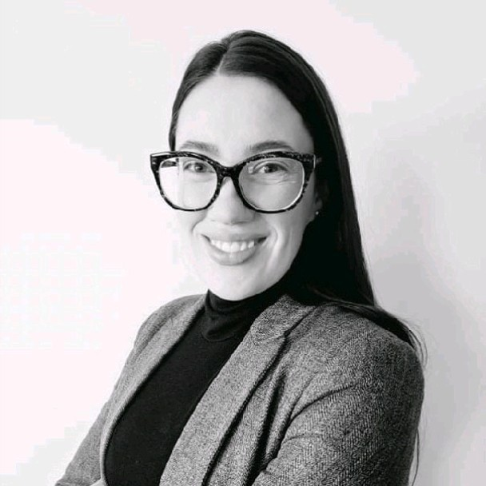
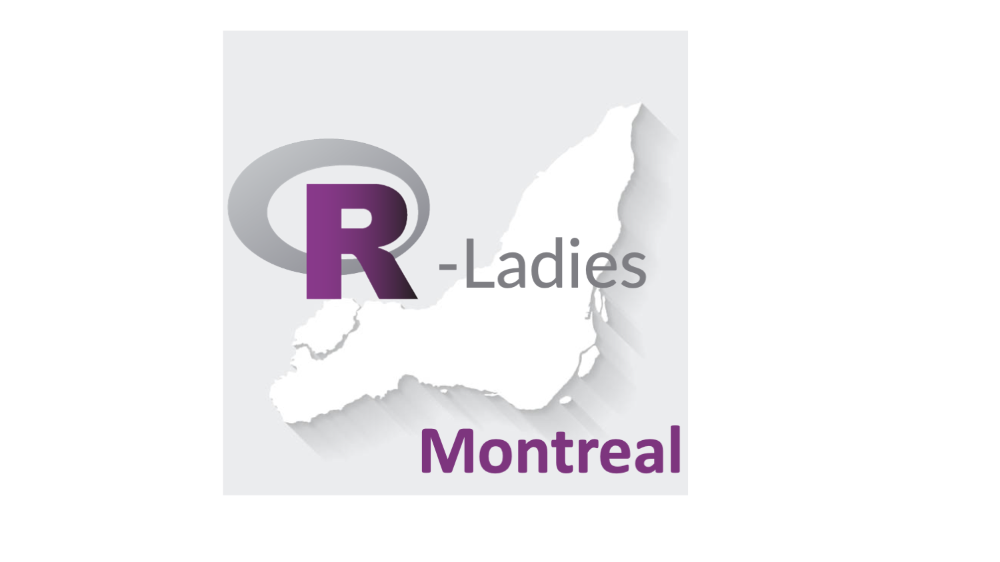
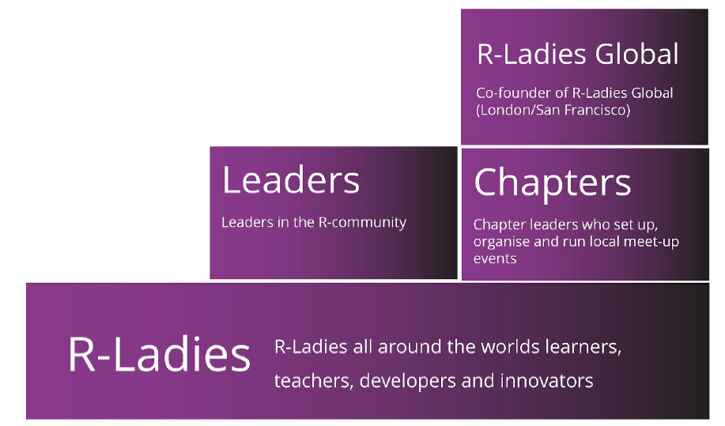

<style>
pre {
    line-height: 1.5em;
    font-size: 18px;
}
</style>


```{r setup, include=FALSE}
knitr::opts_chunk$set(echo = FALSE)
library(dplyr)
library(ggplot2)
```

## RLadies Montreal Reboot: 2023-24

Welcome! Today's agenda:

6:00 - 6:15: Settling in 

6:15 - 6:30: Introductions 

6:30 - 6:45: Brief history of RLadies Montreal + 2023-24 Plan

6:45 - 7:00: Introduction to data wrangling with dplyr

7:00 - 8:00: Interactive dplyr work/networking period


## Introductions: Kathryn Morrison


```{r, echo=FALSE, fig.align='center'}
   knitr::include_graphics('./Kathryn.jpg')
```


## Introductions: Monica Cella

```{r, echo=FALSE, fig.align='center'}
   
```


## Introductions: Rhiannon Kamstra 

```{r, echo=FALSE, fig.align='center'}
   knitr::include_graphics('./Rhiannon.jpg')
```


## Introductions: You!  

* Name, what you do for work or study, what brought you here, anything else you want to share

```{r, echo=FALSE, fig.align='center'}
   
```


## What is RLadies?

* R Ladies Global seeks to achieve proportionate representation by encouraging, inspiring, and empowering the minorities currently underrepresented in the R community 

The two primary mechanisms for facilitating this change are: 

1. Supporting the R enthusiasts who identify as an underrepresented minority to achieve their programming potential 

2. Building a collaborative global network of R leaders, mentors, learners, and developers


## What is RLadies?

We focus on the R language/environment (but if you want to talk about python or SAS, you won't be banned)

Represented/Majority Gender is welcome, but not prioritised 

All members must follow the [RLadies Code of Conduct](https://github.com/rladies/starter-kit/blob/master/RLadiesRulesAndGuideLinesENES.md#CoCEN)

* Community driven, independent, free of charge
* Safe and friendly, zero harassment!  


```{r, echo=FALSE, fig.align='center'}
   
```


## Brief history of RLadies Montreal + plan for this year

* Started by Kathryn + Erika in March 2018, had a very active chapter until the plague hit in 2020

* Past corporate sponsors: Plotly, Upgrade, Precision Analytics

* Always looking for new sponsors and more importantly, <b> volunteer presenters! </b>

* Any topic is welcome and you don't need to be an expert - sometimes giving an introductory workshop or lesson is the best way to learn


## Brief history of RLadies Montreal + plan for this year

* We will send out a survey with requests for specific topics

* We generally for each session, we generally follow this format: 

    * a brief hello/welcome from the organizors

    * an opportunity for anyone hiring or looking for work to mention it
    
    * tutorial or seminar 

* We're very open to changes + suggestions! 


## Brief history of RLadies Montreal + plan for this year

* Past tutorial/workshops included: data vis/ggplot2, intro to dashboard development with shiny, intro to machine learning/deep learning, intro to git/github, intro to DashR 

* Past seminars included: Financial analysis in R, women in tech survey analysis, reproducibile research, spatial analysis in R, causal inference in R  

* Tutorials are often brief (15-30 mins of speaking) followed by lots of "hands-on" coding time

* Seminars are also usually brief (but can be longer) follow by discussion/networking time 


## Introduction to data wrangling with dplyr

 * What is the dplyr package - familiar if you know SQL 
 
 * The most common "verbs": mutate, select, filter, summarise, arrange 
 
 * Joining: left, right, inner, and full (outer) joins 
 
 * Practice time 
 
 
## Cheat sheet for dplyr 
 
Very useful summary of key functions 

https://github.com/rstudio/cheatsheets/blob/main/data-transformation.pdf


```{r, echo=FALSE, fig.align='center'}
   knitr::include_graphics('./dplyr-cheatsheet.png', dpi = 200)
```


## The %>% ("pipe") command 


If you've seen | in bash programming, same idea! 

Pipes are a way to chain multiple operations together 

They take the output of the expression on its left and passes it as the first argument to the function on its right 

Using pipes in R allows us to link a sequence of data cleaning and analysis steps


## Common "verbs" for dplyr 

select() picks variables based on their names

filter() picks cases based on their values

arrange() changes the ordering of the rows

mutate() adds new variables that are functions of existing variables

summarise() reduces multiple values down to a single summary ( usually with group_by() )


## Common "verbs" for dplyr 

Walk through examples in R 


## Practice {.smaller}

Using the 'msleep' dataset, answer the following problems using dplyr 
Refer to the "cheat sheet", google, or ask us if you get stuck - I haven't covered every detail!


* What are the average (mean) body weights of herbivores vs. carnivores?  

* How many animals sleep 12 hours or less total? 

* Create a new variable that is called "sleep_total_minutes" and displays the sleep_total variable but in minutes instead of hours

* Create a new dataframe that looks like the one below, and then join it to the original data such that you don't lose any rows in the original data set 

Should be mean_ORDER_awake_time, not genus!

```{r, echo=FALSE, fig.align='center'}
   knitr::include_graphics('./table.png', dpi = 300)
```


## Possible solutions (there are many ways to achieve the same thing!)


```{r, eval=FALSE, echo=T}

msleep %>% select(vore, bodywt) %>% 
  group_by(vore) %>% 
  summarise(mean_wt = mean(bodywt))

msleep %>% filter(sleep_total < 12) %>% count()

msleep %>% mutate(sleep_total_minutes = sleep_total * 60)

msleep2 <- msleep %>% 
  group_by(order) %>% 
  summarise(max_order_awake_time = max(awake))

msleep %>% left_join(msleep2, by = "order") 

```


